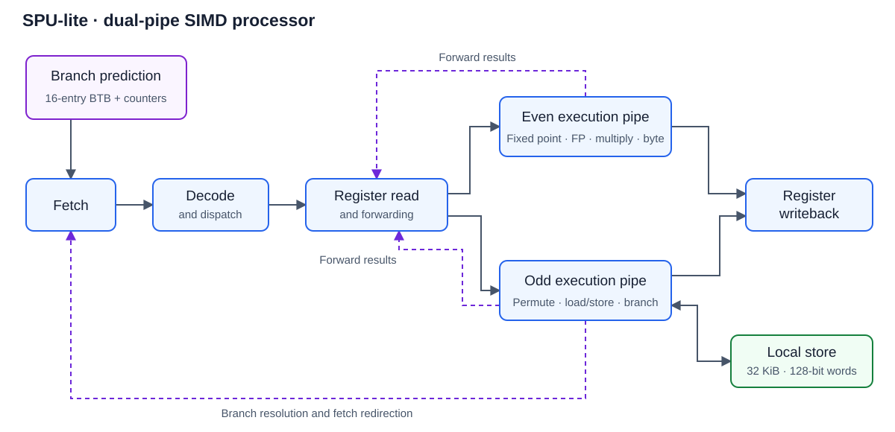

# SPU-lite: Dual-Issue SIMD Processor

A SystemVerilog simulation of an SPU-inspired processor with an 11-stage pipeline,
128-bit SIMD datapath, dual execution pipes, data forwarding, hazard handling,
and branch prediction. Includes a Python assembler and self-checking simulations.
Developed as an ESE 545 course project.

## Architecture

| Component | Implementation |
|---|---|
| Pipeline | Fetch, decode, register read/forwarding, eight execution/forwarding/writeback stages |
| Register file | 128 registers × 128 bits |
| Even pipe | Fixed-point arithmetic, floating-point arithmetic, integer multiply, byte operations |
| Odd pipe | Permutation, load/store, branch operations |
| Dependencies | Forwarding, stalls, and slot replay for issue conflicts |
| Branch prediction | 16-entry branch target buffer and 2-bit prediction counters |
| Instruction memory | 512 × 32-bit words (2 KiB) |
| Local store | 2,048 × 128-bit quadwords (32 KiB) |



This is a functional simulation project. Floating-point execution uses behavioral
SystemVerilog `shortreal`; FPGA deployment, synthesis, timing closure, complete
SPU ISA conformance, and IEEE-754 edge-case conformance have not been established.
The assembler supports a subset of SPU instructions and does not schedule bundles.

## Quick start

Requirements: Bash, Python 3, and a licensed Questa/ModelSim installation exposing
`vlib`, `vlog`, and `vsim` on `PATH`. The historical simulation used Questa 2023.4_3.
No third-party Python packages are needed. Simulator compatibility with this
reorganized version still needs to be verified on a licensed installation.

```bash
# Python-only tests; does not require a simulator
./build.sh assembler

# Assemble and simulate all three checked programs
./build.sh

# Individual simulation or optional waveform output
./build.sh matmul
DUMP=1 ./build.sh demo
```

Set `PYTHON=/path/to/python3` if Python is not named `python3` in your environment.
Run these commands from the repository root. Each simulation invocation creates
an isolated `build/run.*` directory containing generated hex files, compilation
and simulation logs, and any requested VCD waveforms. A successful checked run
must emit `REGRESSION PASS: <mode> (<count> checks)`; failures return nonzero.

## Verification and results

| Test | Purpose | Status |
|---|---|---|
| Python assembler suite | Original program encodings, invalid input, backward branch labels/numeric offsets, CLI padding and capacity | 5 tests passed during repository preparation |
| `demo` | Final register checks for issue conflicts, forwarding, dependent arithmetic, branches, and loops | Program and checker preserved; simulation rerun pending |
| `matmul` | 4×4 floating-point matrix multiply; check all 16 output values | Original transcript: 16/16 pass, STOP at cycle 440; rerun pending |
| `lanes` | Distinct values in all four SIMD lanes; add, store, reload, and dependent add | New program assembles; 8 result checks await simulation |

The matrix result is **historical evidence**, not a new measurement of the revised
testbench. Cycle 440 is the reported STOP cycle; the testbench then allows another
20 clocks for pipeline draining. Do not interpret it as a frequency or throughput
measurement. The demo checks outcomes, not exact stall counts or predictor accuracy.

- [Instruction-set table (PDF)](docs/instruction-set.pdf) — instruction mnemonics, operation descriptions, execution pipes, and listed latencies; supplied project reference, not a verified coverage report.
- [Verification plan and limitations](docs/verification.md)
- [Original matrix simulation output](docs/results/matmul-original.txt)
- [Original project report (PDF)](docs/part1_report_jing_jin.pdf)
- [Architecture notes and waveform walkthrough](docs/architecture.md)

## Repository layout

```text
rtl/                  Processor, register file, and shared definitions
tb/                  Self-checking SystemVerilog testbench
tools/               Python assembler
tests/programs/      Demo, matrix multiply, and distinct-lane assembly
tests/fixtures/      Original demo/matrix hex files for encoding regression
tests/test_assembler.py
scripts/             Reproducible test runner
docs/                Original report, architecture, verification, saved results
.github/workflows/   Python test automation
```

## Project provenance

The original source was copied from the ESE 545 final-project directory.
The report filename identifies Jing Jin. Individual ownership versus team
contributions still needs confirmation before adding a detailed authorship claim.
Repository preparation added documentation, a runner, assembler tests, a SIMD lane
test, strict testbench failure handling, and a negative numeric branch-offset fix.
The processor RTL itself was preserved unchanged.

A redistribution license has not been selected. The original report is preserved
unchanged and has not been reviewed as part of the repository preparation.
